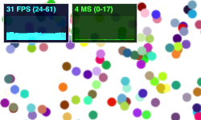

# `localStorage` performance impact test

This is a simple test page created to see how much of an impact `localStorage` has on the performance.

It uses [`effector`](https://github.com/effector/effector) and [`effector-storage`](https://github.com/yumauri/effector-storage).<br>
Related issue [#4](https://github.com/yumauri/effector-storage/issues/4)

## Test methodics

There is a canvas element on the page. Initially it is filled with 100 moving circles. Each circle's state is stored in a separate `effector` store. On each animation frame each circle moves in a random direction.

You can click on the canvas to add more circles. Each click adds 100 more circles.

## Screenshots

| 50 circles                         | 2000 circles                       |
| ---------------------------------- | ---------------------------------- |
|  |  |

## Launch

Run page without using `persist` (reference values):

```
pnpm reference
```

Run page with using `persist` with `nil` adapter (which does nothing, there is only `persist` overhead itself):

```
pnpm nil
```

Run page with using `persist` with `memory` adapter (each circle's store state is persisted synchronously in `Map` in memory):

```
pnpm memory
```

Run page with using `persist` with `local` adapter (each circle's store state is persisted synchronously in the `localStorage`):

```
pnpm local
```

You can also run page with using `persist` with `local` adapter without syncronization (`persist` will not add listeners to `'storage'` event), but I didn't see any difference in performance with or without syncronization, so I didn't include it in the table below:

```
pnpm local-nosync
```

## Results

On my MacBook Pro (13-inch, 2020)

- 2,3 GHz Quad-Core Intel Core i7
- 32 GB 3733 MHz LPDDR4X
- Intel Iris Plus Graphics 1536 MB

I got the following results (highest average, ceil to integer):

### Google Chrome version 112.0.5615.137 (Official Build) (x86_64)

| circles | reference | nil | memory | local |
| ------- | --------- | --- | ------ | ----- |
| 100     | 60        | 60  | 60     | 60    |
| 200     | 60        | 60  | 60     | 60    |
| 300     | 60        | 60  | 60     | 46    |
| 400     | 60        | 60  | 60     | 34    |
| 500     | 60        | 60  | 60     | 28    |
| 600     | 60        | 53  | 50     | 24    |
| 700     | 60        | 46  | 43     | 20    |
| 800     | 60        | 40  | 38     | 17    |
| 900     | 60        | 35  | 33     | 16    |
| 1000    | 57        | 32  | 30     | 14    |
| 1100    | 54        | 28  | 27     | 13    |
| 1200    | 50        | 26  | 25     | 12    |
| 1300    | 46        | 24  | 23     | 11    |
| 1400    | 44        | 22  | 21     | 10    |
| 1500    | 42        | 21  | 20     | 9     |
| 1600    | 40        | 19  | 18     | 8     |
| 1700    | 37        | 18  | 17     | 8     |
| 1800    | 34        | 17  | 16     | 8     |
| 1900    | 31        | 15  | 15     | 8     |
| 2000    | 31        | 15  | 15     | 7     |

### Mozilla Firefox version 112.0.2 (64-bit)

| circles | reference | nil | memory | local |
| ------- | --------- | --- | ------ | ----- |
| 100     | 60        | 60  | 60     | 60    |
| 200     | 60        | 60  | 60     | 60    |
| 300     | 60        | 60  | 60     | 50    |
| 400     | 60        | 55  | 52     | 37    |
| 500     | 60        | 47  | 41     | 30    |
| 600     | 60        | 36  | 35     | 26    |
| 700     | 60        | 30  | 30     | 22    |
| 800     | 60        | 27  | 26     | 19    |
| 900     | 60        | 24  | 23     | 17    |
| 1000    | 60        | 21  | 21     | 15    |
| 1100    | 60        | 19  | 19     | 13    |
| 1200    | 60        | 17  | 17     | 13    |
| 1300    | 60        | 16  | 16     | 11    |
| 1400    | 60        | 15  | 15     | 11    |
| 1500    | 60        | 14  | 14     | 10    |
| 1600    | 60        | 13  | 13     | 9     |
| 1700    | 60        | 12  | 12     | 9     |
| 1800    | 60        | 12  | 11     | 8     |
| 1900    | 60        | 11  | 11     | 7     |
| 2000    | 60        | 10  | 10     | 7     |

### Safari version 16.4.1 (17615.1.26.101.10, 17615)

| circles | reference | nil | memory | local |
| ------- | --------- | --- | ------ | ----- |
| 100     | 60        | 60  | 60     | 60    |
| 200     | 60        | 51  | 50     | 45    |
| 300     | 60        | 36  | 36     | 33    |
| 400     | 60        | 28  | 28     | 25    |
| 500     | 60        | 23  | 22     | 21    |
| 600     | 60        | 19  | 19     | 17    |
| 700     | 60        | 16  | 16     | 15    |
| 800     | 60        | 15  | 15     | 13    |
| 900     | 60        | 13  | 13     | 12    |
| 1000    | 60        | 12  | 12     | 11    |
| 1100    | 60        | 11  | 11     | 10    |
| 1200    | 60        | 10  | 10     | 9     |
| 1300    | 60        | 9   | 9      | 8     |
| 1400    | 60        | 9   | 9      | 8     |
| 1500    | 60        | 8   | 8      | 7     |
| 1600    | 60        | 8   | 8      | 7     |
| 1700    | 60        | 7   | 7      | 6     |
| 1800    | 60        | 7   | 7      | 6     |
| 1900    | 59        | 6   | 6      | 6     |
| 2000    | 56        | 6   | 6      | 5     |
