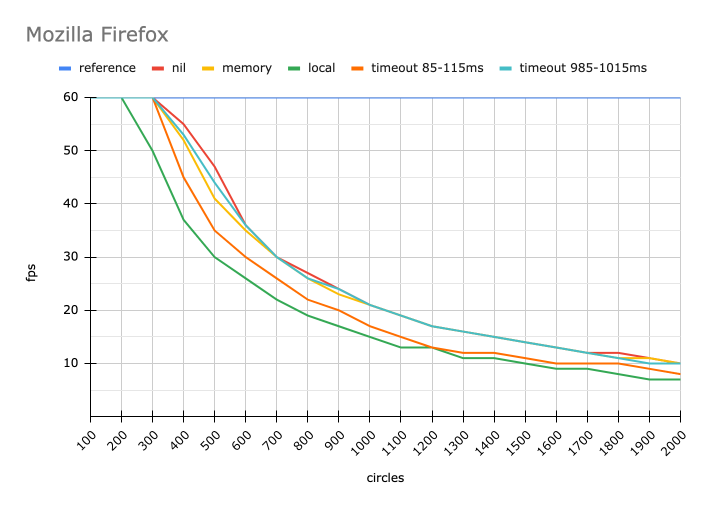

# `localStorage` performance impact test

This is a simple test page created to see how much of an impact `localStorage` has on the performance.

It uses [`effector`](https://github.com/effector/effector) and [`effector-storage`](https://github.com/yumauri/effector-storage).<br>
Related issue [#4](https://github.com/yumauri/effector-storage/issues/4)

## Test methodics

There is a canvas element on the page. Initially it is filled with 100 moving circles. Each circle's state is stored in a separate `effector` store. On each animation frame each circle moves in a random direction.

You can click on the canvas to add more circles. Each click adds 100 more circles.

## Screenshots

| 50 circles                         | 2000 circles                       |
| ---------------------------------- | ---------------------------------- |
|  |  |

## Launch

Run page without using `persist` (reference values):

```
pnpm reference
```

Run page with using `persist` with `nil` adapter (which does nothing, there is only `persist` overhead itself):

```
pnpm nil
```

Run page with using `persist` with `memory` adapter (each circle's store state is persisted synchronously in `Map` in memory):

```
pnpm memory
```

Run page with using `persist` with `local` adapter (each circle's store state is persisted synchronously in the `localStorage`):

```
pnpm local
```

You can also run page with using `persist` with `local` adapter without syncronization (`persist` will not add listeners to `'storage'` event), but I didn't see any difference in performance with or without syncronization, so I didn't include it in the table below:

```
pnpm local-nosync
```

_(This feature of `effector-storage` is not released yet)_<br>
Run page with using `persist` with `local` adapter with `timeout` (each circle's store state is persisted asynchronously in the `localStorage` with random timeout within 85-115ms):

```
pnpm local-timeout
```

_(This feature of `effector-storage` is not released yet)_<br>
Or with random timeout within 985-1015ms:

```
pnpm local-big-timeout
```

## Results

On my MacBook Pro (13-inch, 2020)

- 2,3 GHz Quad-Core Intel Core i7
- 32 GB 3733 MHz LPDDR4X
- Intel Iris Plus Graphics 1536 MB

I got the following results (highest average, ceil to integer):

### Google Chrome version 112.0.5615.137 (Official Build) (x86_64)

| circles | reference | nil | memory | local | timeout 85-115ms | timeout 985-1015ms |
| ------- | --------- | --- | ------ | ----- | ---------------- | ------------------ |
| 100     | 60        | 60  | 60     | 60    | 60               | 60                 |
| 200     | 60        | 60  | 60     | 60    | 60               | 60                 |
| 300     | 60        | 60  | 60     | 46    | 57               | 60                 |
| 400     | 60        | 60  | 60     | 34    | 46               | 60                 |
| 500     | 60        | 60  | 60     | 28    | 35               | 58                 |
| 600     | 60        | 53  | 50     | 24    | 28               | 47                 |
| 700     | 60        | 46  | 43     | 20    | 24               | 35                 |
| 800     | 60        | 40  | 38     | 17    | 20               | 35                 |
| 900     | 60        | 35  | 33     | 16    | 18               | 30                 |
| 1000    | 57        | 32  | 30     | 14    | 17               | 26                 |
| 1100    | 54        | 28  | 27     | 13    | 14               | 24                 |
| 1200    | 50        | 26  | 25     | 12    | 13               | 22                 |
| 1300    | 46        | 24  | 23     | 11    | 12               | 20                 |
| 1400    | 44        | 22  | 21     | 10    | 11               | 18                 |
| 1500    | 42        | 21  | 20     | 9     | 11               | 17                 |
| 1600    | 40        | 19  | 18     | 8     | 9                | 14                 |
| 1700    | 37        | 18  | 17     | 8     | 9                | 14                 |
| 1800    | 34        | 17  | 16     | 8     | 8                | 13                 |
| 1900    | 31        | 15  | 15     | 8     | 8                | 12                 |
| 2000    | 31        | 15  | 15     | 7     | 8                | 11                 |


### Mozilla Firefox version 112.0.2 (64-bit)

| circles | reference | nil | memory | local | timeout 85-115ms | timeout 985-1015ms |
| ------- | --------- | --- | ------ | ----- | ---------------- | ------------------ |
| 100     | 60        | 60  | 60     | 60    | 60               | 60                 |
| 200     | 60        | 60  | 60     | 60    | 60               | 60                 |
| 300     | 60        | 60  | 60     | 50    | 60               | 60                 |
| 400     | 60        | 55  | 52     | 37    | 45               | 53                 |
| 500     | 60        | 47  | 41     | 30    | 35               | 44                 |
| 600     | 60        | 36  | 35     | 26    | 30               | 36                 |
| 700     | 60        | 30  | 30     | 22    | 26               | 30                 |
| 800     | 60        | 27  | 26     | 19    | 22               | 26                 |
| 900     | 60        | 24  | 23     | 17    | 20               | 24                 |
| 1000    | 60        | 21  | 21     | 15    | 17               | 21                 |
| 1100    | 60        | 19  | 19     | 13    | 15               | 19                 |
| 1200    | 60        | 17  | 17     | 13    | 13               | 17                 |
| 1300    | 60        | 16  | 16     | 11    | 12               | 16                 |
| 1400    | 60        | 15  | 15     | 11    | 12               | 15                 |
| 1500    | 60        | 14  | 14     | 10    | 11               | 14                 |
| 1600    | 60        | 13  | 13     | 9     | 10               | 13                 |
| 1700    | 60        | 12  | 12     | 9     | 10               | 12                 |
| 1800    | 60        | 12  | 11     | 8     | 10               | 11                 |
| 1900    | 60        | 11  | 11     | 7     | 9                | 10                 |
| 2000    | 60        | 10  | 10     | 7     | 8                | 10                 |



### Safari version 16.4.1 (17615.1.26.101.10, 17615)

| circles | reference | nil | memory | local | timeout 85-115ms | timeout 985-1015ms |
| ------- | --------- | --- | ------ | ----- | ---------------- | ------------------ |
| 100     | 60        | 60  | 60     | 60    | 60               | 60                 |
| 200     | 60        | 51  | 50     | 45    | 46               | 45                 |
| 300     | 60        | 36  | 36     | 33    | 31               | 34                 |
| 400     | 60        | 28  | 28     | 25    | 23               | 24                 |
| 500     | 60        | 23  | 22     | 21    | 19               | 20                 |
| 600     | 60        | 19  | 19     | 17    | 16               | 16                 |
| 700     | 60        | 16  | 16     | 15    | 14               | 16                 |
| 800     | 60        | 15  | 15     | 13    | 13               | 13                 |
| 900     | 60        | 13  | 13     | 12    | 11               | 12                 |
| 1000    | 60        | 12  | 12     | 11    | 10               | 11                 |
| 1100    | 60        | 11  | 11     | 10    | 9                | 10                 |
| 1200    | 60        | 10  | 10     | 9     | 8                | 9                  |
| 1300    | 60        | 9   | 9      | 8     | 7                | 8                  |
| 1400    | 60        | 9   | 9      | 8     | 7                | 8                  |
| 1500    | 60        | 8   | 8      | 7     | 7                | 7                  |
| 1600    | 60        | 8   | 8      | 7     | 6                | 7                  |
| 1700    | 60        | 7   | 7      | 6     | 6                | 6                  |
| 1800    | 60        | 7   | 7      | 6     | 5                | 6                  |
| 1900    | 59        | 6   | 6      | 6     | 5                | 5                  |
| 2000    | 56        | 6   | 6      | 5     | 5                | 5                  |


## Why `persist` makes so big overhead?

Looking at the results you might wonder: "Why `persist` with `nil` adapter (which doing nothing) makes such big overhead? Should I use it at all then?"

Wait, let me explain.

Even while `nil` adapter is doing nothing, `persist` is doing some work. For example, it should synchronize different stores, persisted with the same `key`, even with `nil` adapter, this is by design. To do its work, `persist` creates bunch of units and bunch of connections between them. How many? Let's find out.

But first, I want to make a note, that you probably should not persist hundreds and thousands of stores in `localStorage`. If you do so, maybe you are doing something wrong. And I suggest you to check [`effector-localstorage`](https://github.com/ilyalesik/effector-localstorage) library, which creates zero overhead (aside from working with `localStorage`), because it doesn't create any effector units at all.

Ok, to the numbers.

In the version 5.0.1 in this test each `persist` call creates

- 1 store
- 1 cleanup node
- 2 effects
- 7 events

And connects them using

- 1 region
- 2 samples
- 1 guard
- 4 forwards

Is it too many? I don't think so. But how many units declarations is that?

Using new [Inspect API](https://effector.dev/docs/api/effector/inspect) it is possible to count exactly, how many units were created (or "declared"), and how many "computations" effector kernel is making on each animation step.

For each circle `persist` makes 41 declarations.

Not too much, but with increasing numbers this grows drastically:

| circles | declarations (reference) | computations (reference) | declarations (`persist`) | computations (`persist`) |
| ------- | ------------------------ | ------------------------ | ------------------------ | ------------------------ |
| 100     | 321                      | 301                      | 4121                     | 5001                     |
| 200     | 621                      | 601                      | 8221                     | 10001                    |
| 300     | 921                      | 901                      | 12321                    | 15001                    |
| 400     | 1221                     | 1201                     | 16421                    | 20001                    |
| 500     | 1521                     | 1501                     | 20521                    | 25001                    |
| 600     | 1821                     | 1801                     | 24621                    | 30001                    |
| 700     | 2121                     | 2101                     | 28721                    | 35001                    |
| 800     | 2421                     | 2401                     | 32821                    | 40001                    |
| 900     | 2721                     | 2701                     | 36921                    | 45001                    |
| 1000    | 3021                     | 3001                     | 41021                    | 50001                    |
| 1100    | 3321                     | 3301                     | 45121                    | 55001                    |
| 1200    | 3621                     | 3601                     | 49221                    | 60001                    |
| 1300    | 3921                     | 3901                     | 53321                    | 65001                    |
| 1400    | 4221                     | 4201                     | 57421                    | 70001                    |
| 1500    | 4521                     | 4501                     | 61521                    | 75001                    |
| 1600    | 4821                     | 4801                     | 65621                    | 80001                    |
| 1700    | 5121                     | 5101                     | 69721                    | 85001                    |
| 1800    | 5421                     | 5401                     | 73821                    | 90001                    |
| 1900    | 5721                     | 5701                     | 77921                    | 95001                    |
| 2000    | 6021                     | 6001                     | 82021                    | 100001                   |

So, with `persist`, applied to the each circle state, effector kernel have to make ×17 "computations", no surprise that performance become worse.

In `persist`'s defense, instead of excuse, I want to point out, that this test was not aimed to check `persist` performance, but impact of saving data synchronously to the `localStorage`. As I mentioned earlier, you probably should not persist hundreds and thousands of stores in `localStorage`. But with huge numbers it is better to see impact, which I want to see. That is why test is designed this way.

Do not judge `effector-storage` by it :)
